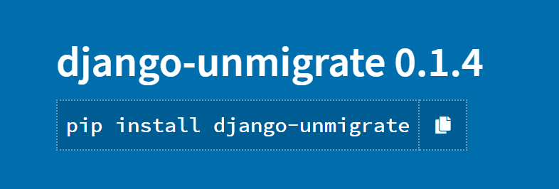
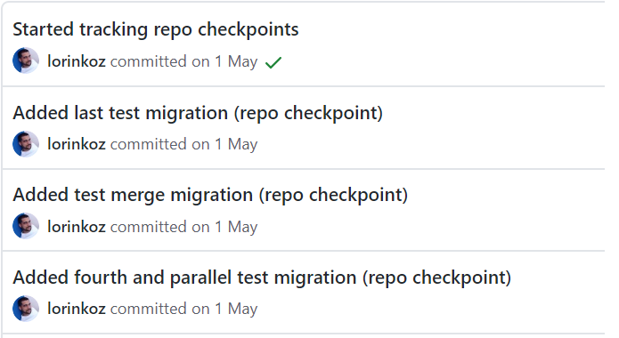

name: title
class: middle

# Switch branches without (too much) worry, or .blue[django-unmigrate]


Lorenzo Peña &middot; @lorinkoz

---

class: middle center


---

class: middle center


---

## The old ways

--

```bash
git diff master --name-only | grep migrations
```

--

mental migration name arithmetic.ref[1]

.bottom[
.footnote[.ref[1] https://adamj.eu/tech/2020/02/24/how-to-disallow-auto-named-django-migrations/]
]

--

```bash
python manage.py migrate some_app some_migration
```

---

class: middle center

# Git 🤝 Django

---

class: middle center



https://pypi.org/project/django-unmigrate

---

## The new way

```bash
python manage.py unmigrate master
python manage.py unmigrate
```

--

```bash
python manage.py unmigrate HEAD~12
python manage.py unmigrate b13553d
python manage.py unmigrate v1.33.7
```

--

```bash
python manage.py unmigrate --dry-run
python manage.py unmigrate --fake
```

--

```bash
python manage.py unmigrate --clean    <-- open PR
```

---

## No more master

--

```python
# settings.py
MAIN_BRANCH = "main"
```

---

## Testing

.left-column-33[.right[]]

--

.right-column-66[]

---

class: middle center

It's time to give back to the community: for every ⭐ you send to this repo, I'll send you ⭐⭐ back to yours.

https://github.com/lorinkoz/django-unmigrate

---

template: title
